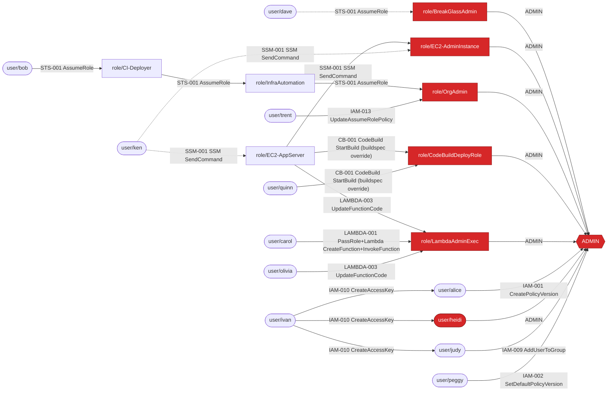

# Examples

These examples run iampath against the synthetic account in `testdata/`
(account `111122223333`, 16 users and 12 roles).

| Principal | What the fixture demonstrates |
|---|---|
| `user/alice` | `iam:CreatePolicyVersion` on a policy attached to her own group (1 step) |
| `user/bob` | 3-hop role chain: bob → CI-Deployer → InfraAutomation → OrgAdmin |
| `user/carol` | `iam:PassRole` + `lambda:CreateFunction` + `lambda:InvokeFunction` to an admin execution role |
| `user/dave` | Conditional path: BreakGlassAdmin trust requires `aws:MultiFactorAuthPresent` |
| `user/erin` | `iam:PutUserPolicy` on herself, **blocked by a permissions boundary** |
| `user/frank` | `iam:AttachUserPolicy` on himself, **blocked by an SCP** (only with `--scp`) |
| `user/ivan` | `iam:CreateAccessKey` on every user, so several alternative paths |
| `user/judy` | `iam:AddUserToGroup` into the Admins group |
| `user/ken` | PassRole limited by `iam:PassedToService` (no EC2 path). With `--ec2-instances`, a conditional SSM path |
| `user/olivia` | `lambda:UpdateFunctionCode` on a function with an admin role (needs `--lambda-functions`) |
| `user/peggy` | `iam:SetDefaultPolicyVersion` restores an old `Action:*` version |
| `user/quinn` | `codebuild:StartBuild` on a project with an IAM-admin service role (needs `--codebuild-projects`) |
| `user/trent` | `iam:UpdateAssumeRolePolicy` on OrgAdmin |
| `user/grace`, `user/svc-backup`, several roles | No path |

To regenerate every output file in this directory, run this from the
repository root:

```sh
sh examples/generate.sh
```

The script writes:

- `paths-baseline.txt`: `iampath paths -i testdata/account.json`
- `paths-full.txt`, `paths-full.mmd`, `paths-full.dot`: the same analysis
  with the SCP file and all three inventories
- `who-can-passrole.txt`, `explain-boundary.txt`, `explain-scp.txt`,
  `explain-trust.txt`: the query commands shown in the top-level README

## Baseline: authorization details only

```console
$ iampath paths -i testdata/account.json
iampath 0.1.0 - offline IAM privilege-escalation analysis
Account 111122223333: 28 principals, 28 escalation edges, 6 admin-equivalent principals.

Administrator-equivalent principals:
  role/BreakGlassAdmin      effective policy allows * on *
  role/EC2-AdminInstance    effective policy allows * on *
  role/OrgAdmin             effective policy allows * on *
  role/CodeBuildDeployRole  effective policy allows iam:* on *
  role/LambdaAdminExec      effective policy allows * on *
  user/heidi                effective policy allows * on *

Escalation paths: 12 principals can reach ADMIN (10 unconditionally, 2 only conditionally).

[1] role/InfraAutomation  (1 step, cost 1)
    role/InfraAutomation --[STS-001 AssumeRole]--> role/OrgAdmin ==> ADMIN

[2] user/alice  (1 step, cost 1)
    user/alice --[IAM-001 CreatePolicyVersion on arn:aws:iam::111122223333:policy/DeveloperPolicy]--> ADMIN

[3] user/frank  (1 step, cost 1)
    user/frank --[IAM-003 AttachUserPolicy on arn:aws:iam::111122223333:user/frank (attach arn:aws:iam::aws:policy/AdministratorAccess)]--> ADMIN

[4] user/ivan  (1 step, cost 1)
    path 1 (1 step, cost 1):
      user/ivan --[IAM-010 CreateAccessKey]--> user/heidi ==> ADMIN
    path 2 (2 steps, cost 2):
      user/ivan --[IAM-010 CreateAccessKey]--> user/alice --[IAM-001 CreatePolicyVersion on arn:aws:iam::111122223333:policy/DeveloperPolicy]--> ADMIN
    path 3 (2 steps, cost 2):
      user/ivan --[IAM-010 CreateAccessKey]--> user/frank --[IAM-003 AttachUserPolicy on arn:aws:iam::111122223333:user/frank (attach arn:aws:iam::aws:policy/AdministratorAccess)]--> ADMIN

[5] user/judy  (1 step, cost 1)
    user/judy --[IAM-009 AddUserToGroup on arn:aws:iam::111122223333:group/Admins (join group Admins)]--> ADMIN

[6] user/peggy  (1 step, cost 1)
    user/peggy --[IAM-002 SetDefaultPolicyVersion on arn:aws:iam::111122223333:policy/ReportingAnalystPolicy (restore version v1)]--> ADMIN

[7] role/CI-Deployer  (2 steps, cost 2)
    role/CI-Deployer --[STS-001 AssumeRole]--> role/InfraAutomation --[STS-001 AssumeRole]--> role/OrgAdmin ==> ADMIN

[8] user/carol  (1 step, cost 2)
    user/carol --[LAMBDA-001 PassRole+Lambda CreateFunction+InvokeFunction]--> role/LambdaAdminExec ==> ADMIN

[9] user/trent  (1 step, cost 2)
    user/trent --[IAM-013 UpdateAssumeRolePolicy]--> role/OrgAdmin ==> ADMIN

[10] user/bob  (3 steps, cost 3)
    user/bob --[STS-001 AssumeRole]--> role/CI-Deployer --[STS-001 AssumeRole]--> role/InfraAutomation --[STS-001 AssumeRole]--> role/OrgAdmin ==> ADMIN

[11] role/EC2-AppServer  (1 step, cost 4, CONDITIONAL)
    role/EC2-AppServer --[STS-001 AssumeRole [conditional]]--> role/BreakGlassAdmin ==> ADMIN
      ! trust policy: Bool aws:MultiFactorAuthPresent=[true] (key not known offline)

[12] user/dave  (1 step, cost 4, CONDITIONAL)
    user/dave --[STS-001 AssumeRole [conditional]]--> role/BreakGlassAdmin ==> ADMIN
      ! trust policy: Bool aws:MultiFactorAuthPresent=[true] (key not known offline)

No path to ADMIN (9): role/GlueETLRole, role/LambdaThumbnailer, role/ReadOnlyAuditor, user/erin, user/grace, user/ken, user/olivia, user/quinn, user/svc-backup

Cycles (principals that can reach each other):
  role/CI-Deployer <-> role/InfraAutomation
```

## With the SCP and inventories

```console
$ iampath paths -i testdata/account.json --scp testdata/scp-root.json \n  --lambda-functions testdata/lambda-functions.json \n  --ec2-instances testdata/ec2-instances.json \n  --codebuild-projects testdata/codebuild-projects.json
iampath 0.1.0 - offline IAM privilege-escalation analysis
Account 111122223333: 28 principals, 35 escalation edges, 6 admin-equivalent principals.

Administrator-equivalent principals:
  role/BreakGlassAdmin      effective policy allows * on *
  role/EC2-AdminInstance    effective policy allows * on *
  role/OrgAdmin             effective policy allows * on *
  role/CodeBuildDeployRole  effective policy allows iam:* on *
  role/LambdaAdminExec      effective policy allows * on *
  user/heidi                effective policy allows * on *

Escalation paths: 14 principals can reach ADMIN (12 unconditionally, 2 only conditionally).

[1] role/InfraAutomation  (1 step, cost 1)
    role/InfraAutomation --[STS-001 AssumeRole]--> role/OrgAdmin ==> ADMIN

[2] user/alice  (1 step, cost 1)
    user/alice --[IAM-001 CreatePolicyVersion on arn:aws:iam::111122223333:policy/DeveloperPolicy]--> ADMIN

[3] user/ivan  (1 step, cost 1)
    path 1 (1 step, cost 1):
      user/ivan --[IAM-010 CreateAccessKey]--> user/heidi ==> ADMIN
    path 2 (2 steps, cost 2):
      user/ivan --[IAM-010 CreateAccessKey]--> user/alice --[IAM-001 CreatePolicyVersion on arn:aws:iam::111122223333:policy/DeveloperPolicy]--> ADMIN
    path 3 (2 steps, cost 2):
      user/ivan --[IAM-010 CreateAccessKey]--> user/judy --[IAM-009 AddUserToGroup on arn:aws:iam::111122223333:group/Admins (join group Admins)]--> ADMIN

[4] user/judy  (1 step, cost 1)
    user/judy --[IAM-009 AddUserToGroup on arn:aws:iam::111122223333:group/Admins (join group Admins)]--> ADMIN

[5] user/peggy  (1 step, cost 1)
    user/peggy --[IAM-002 SetDefaultPolicyVersion on arn:aws:iam::111122223333:policy/ReportingAnalystPolicy (restore version v1)]--> ADMIN

[6] role/CI-Deployer  (2 steps, cost 2)
    role/CI-Deployer --[STS-001 AssumeRole]--> role/InfraAutomation --[STS-001 AssumeRole]--> role/OrgAdmin ==> ADMIN

[7] role/EC2-AppServer  (1 step, cost 2)
    path 1 (1 step, cost 2):
      role/EC2-AppServer --[SSM-001 SSM SendCommand on arn:aws:ec2:ca-central-1:111122223333:instance/i-0a1b2c3d4e5f60718 (instance i-0a1b2c3d4e5f60718)]--> role/EC2-AdminInstance ==> ADMIN
    path 2 (1 step, cost 2):
      role/EC2-AppServer --[CB-001 CodeBuild StartBuild (buildspec override) on arn:aws:codebuild:ca-central-1:111122223333:project/infra-deploy (project infra-deploy)]--> role/CodeBuildDeployRole ==> ADMIN
    path 3 (1 step, cost 2):
      role/EC2-AppServer --[LAMBDA-003 UpdateFunctionCode on arn:aws:lambda:ca-central-1:111122223333:function:nightly-report (function nightly-report)]--> role/LambdaAdminExec ==> ADMIN

[8] user/carol  (1 step, cost 2)
    user/carol --[LAMBDA-001 PassRole+Lambda CreateFunction+InvokeFunction]--> role/LambdaAdminExec ==> ADMIN

[9] user/olivia  (1 step, cost 2)
    user/olivia --[LAMBDA-003 UpdateFunctionCode on arn:aws:lambda:ca-central-1:111122223333:function:nightly-report (function nightly-report)]--> role/LambdaAdminExec ==> ADMIN

[10] user/quinn  (1 step, cost 2)
    user/quinn --[CB-001 CodeBuild StartBuild (buildspec override) on arn:aws:codebuild:ca-central-1:111122223333:project/infra-deploy (project infra-deploy)]--> role/CodeBuildDeployRole ==> ADMIN

[11] user/trent  (1 step, cost 2)
    user/trent --[IAM-013 UpdateAssumeRolePolicy]--> role/OrgAdmin ==> ADMIN

[12] user/bob  (3 steps, cost 3)
    user/bob --[STS-001 AssumeRole]--> role/CI-Deployer --[STS-001 AssumeRole]--> role/InfraAutomation --[STS-001 AssumeRole]--> role/OrgAdmin ==> ADMIN

[13] user/dave  (1 step, cost 4, CONDITIONAL)
    user/dave --[STS-001 AssumeRole [conditional]]--> role/BreakGlassAdmin ==> ADMIN
      ! trust policy: Bool aws:MultiFactorAuthPresent=[true] (key not known offline)

[14] user/ken  (1 step, cost 5, CONDITIONAL)
    path 1 (1 step, cost 5):
      user/ken --[SSM-001 SSM SendCommand on arn:aws:ec2:ca-central-1:111122223333:instance/i-0a1b2c3d4e5f60718 (instance i-0a1b2c3d4e5f60718) [conditional]]--> role/EC2-AdminInstance ==> ADMIN
        ! ssm:SendCommand: IpAddress aws:SourceIp=[203.0.113.0/24 198.51.100.0/24] (key not known offline)
    path 2 (2 steps, cost 7):
      user/ken --[SSM-001 SSM SendCommand on arn:aws:ec2:ca-central-1:111122223333:instance/i-0fedcba9876543210 (instance i-0fedcba9876543210) [conditional]]--> role/EC2-AppServer --[SSM-001 SSM SendCommand on arn:aws:ec2:ca-central-1:111122223333:instance/i-0a1b2c3d4e5f60718 (instance i-0a1b2c3d4e5f60718)]--> role/EC2-AdminInstance ==> ADMIN
        ! ssm:SendCommand: IpAddress aws:SourceIp=[203.0.113.0/24 198.51.100.0/24] (key not known offline)
    path 3 (2 steps, cost 7):
      user/ken --[SSM-001 SSM SendCommand on arn:aws:ec2:ca-central-1:111122223333:instance/i-0fedcba9876543210 (instance i-0fedcba9876543210) [conditional]]--> role/EC2-AppServer --[CB-001 CodeBuild StartBuild (buildspec override) on arn:aws:codebuild:ca-central-1:111122223333:project/infra-deploy (project infra-deploy)]--> role/CodeBuildDeployRole ==> ADMIN
        ! ssm:SendCommand: IpAddress aws:SourceIp=[203.0.113.0/24 198.51.100.0/24] (key not known offline)

No path to ADMIN (7): role/GlueETLRole, role/LambdaThumbnailer, role/ReadOnlyAuditor, user/erin, user/frank, user/grace, user/svc-backup

Cycles (principals that can reach each other):
  role/CI-Deployer <-> role/InfraAutomation
```

### Mermaid (`--format mermaid`)



## Explaining decisions

A permissions boundary blocks the action:

```console
$ iampath explain -i testdata/account.json erin iam:PutUserPolicy arn:aws:iam::111122223333:user/erin
Principal: user/erin (arn:aws:iam::111122223333:user/erin)
Request:   iam:PutUserPolicy on arn:aws:iam::111122223333:user/erin
Context:   aws:PrincipalAccount=111122223333 aws:PrincipalArn=arn:aws:iam::111122223333:user/erin aws:PrincipalIsAWSService=false aws:PrincipalTag/team=web aws:PrincipalType=User aws:userid=AIDATFESHO2P2ZV6YIKWZ aws:username=erin
           (other condition keys are unknown offline)

Policies evaluated:
  identity  SelfServiceIAM (inline)
  identity  DeveloperPolicy (group:Developers)
  boundary  DeveloperBoundary
  scp       (none supplied)

Matching statements:
  [identity] SelfServiceIAM (inline) stmt ManageOwnUserPolicies: Allow

Evaluation (AWS order):
  explicit deny          false
  identity               true
  permissions boundary   false

Decision: ImplicitDeny
  not allowed by permissions boundary DeveloperBoundary (permissions boundary)
```

An SCP denies the action:

```console
$ iampath explain -i testdata/account.json --scp testdata/scp-root.json frank iam:AttachUserPolicy arn:aws:iam::111122223333:user/frank
Principal: user/frank (arn:aws:iam::111122223333:user/frank)
Request:   iam:AttachUserPolicy on arn:aws:iam::111122223333:user/frank
Context:   aws:PrincipalAccount=111122223333 aws:PrincipalArn=arn:aws:iam::111122223333:user/frank aws:PrincipalIsAWSService=false aws:PrincipalTag/team=web aws:PrincipalType=User aws:userid=AIDA5GHYHXA5IPD5EWMGY aws:username=frank
           (other condition keys are unknown offline)

Policies evaluated:
  identity  ManageOwnPermissions (inline)
  boundary  (none)
  scp L1    FullAWSAccess, DenyIAMUserPolicyChanges

Matching statements:
  [identity] ManageOwnPermissions (inline) stmt SelfManagedPolicies: Allow
  [scp] FullAWSAccess (scp) stmt #0: Allow
  [scp] DenyIAMUserPolicyChanges (scp) stmt DenyIAMUserPolicyChanges: Deny

Evaluation (AWS order):
  explicit deny          true

Decision: ExplicitDeny
  explicitly denied by [scp] DenyIAMUserPolicyChanges (scp) stmt DenyIAMUserPolicyChanges: Deny
```

A trust policy condition can't be resolved offline:

```console
$ iampath explain -i testdata/account.json dave sts:AssumeRole arn:aws:iam::111122223333:role/BreakGlassAdmin
Principal: user/dave (arn:aws:iam::111122223333:user/dave)
Request:   sts:AssumeRole on arn:aws:iam::111122223333:role/BreakGlassAdmin
Context:   aws:PrincipalAccount=111122223333 aws:PrincipalArn=arn:aws:iam::111122223333:user/dave aws:PrincipalIsAWSService=false aws:PrincipalTag/team=sre aws:PrincipalType=User aws:userid=AIDARBWFZJTM6FWMAEDBM aws:username=dave
           (other condition keys are unknown offline)

Policies evaluated:
  identity  BreakGlassAccess (inline)
  boundary  (none)
  scp       (none supplied)

Matching statements:
  [identity] BreakGlassAccess (inline) stmt AssumeBreakGlass: Allow

Evaluation (AWS order):
  explicit deny          false
  identity               true

Decision: Allow
  allowed by [identity] BreakGlassAccess (inline) stmt AssumeBreakGlass: Allow

Trust policy of role/BreakGlassAdmin: trust policy allows (unknown)
  [trust] trust policy of BreakGlassAdmin stmt #0: Allow (conditional: Bool aws:MultiFactorAuthPresent=[true] (key not known offline))
  trust names the account: the identity decision above must also be Allow
```

## who-can

```console
$ iampath who-can -i testdata/account.json iam:PassRole arn:aws:iam::111122223333:role/service-role/LambdaAdminExec
PRINCIPAL                 DECISION     DETAIL
role/BreakGlassAdmin      allow        allowed by [identity] AdministratorAccess (managed) stmt #0: Allow
role/EC2-AdminInstance    allow        allowed by [identity] AdministratorAccess (managed) stmt #0: Allow
role/OrgAdmin             allow        allowed by [identity] AdministratorAccess (managed) stmt #0: Allow
role/CodeBuildDeployRole  allow        allowed by [identity] IAMFullAccess (managed) stmt #0: Allow
role/LambdaAdminExec      allow        allowed by [identity] AdministratorAccess (managed) stmt #0: Allow
user/carol                conditional  allowed conditionally: identity allow is conditional ([identity] LambdaDeployPolicy (managed) stmt PassLambdaRoles: Allow (conditional: StringEquals iam:PassedToService=[lambda.amazonaws.com] (key not known offline)))
user/heidi                allow        allowed by [identity] AdministratorAccess (group:Admins) stmt #0: Allow

6 principal(s) allowed, 1 conditionally, for iam:PassRole on arn:aws:iam::111122223333:role/service-role/LambdaAdminExec.
```

